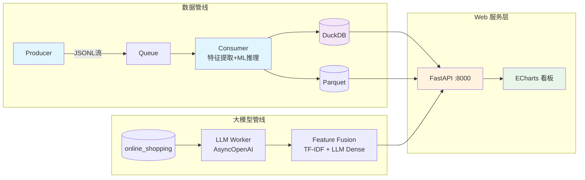

# 大数据分析系统 - E2E 系统联调

## 1. 项目概述与功能特性

本项目整合 14 周实验成果，构建端到端大数据分析系统。

**ETL 数据管线** — IndustrialProducer 生成流式用户行为日志，Consumer 实时特征提取与 ML 推理，数据写入 DuckDB / Parquet。

**ML/LLM 智能引擎** — Random Forest 行为预测模型 + LLM（SiliconFlow API）评论特征提取 + LightGBM 异构特征融合 + SHAP 可解释性分析。

**FastAPI 数据接口** — RESTful API，品类分布统计、情感分析概览、高频词云统计、多维度交叉筛选评论，CORS 全开放。

**ECharts 可视化看板** — 深色主题仪表盘，柱状图 + 堆叠情感图 + 词云三图联动，统一状态机驱动，支持正则搜索。

## 2. 系统架构



## 3. 快速开始

```bash
# 安装依赖
python -m venv venv
venv\Scripts\python.exe -m pip install -r requirements.txt

# 配置 API Key（可选）
cp .env.example .env

# 一键启动
python run_app.py

# 访问 http://127.0.0.1:8000
```

## 4. 配置说明

复制 `.env.example` 为 `.env`，填入 API Key：

```bash
SILICONFLOW_API_KEY=sk-your-key-here
DASHSCOPE_API_KEY=sk-your-key-here
```

未配置 API Key 时 LLM 功能将优雅降级，不影响 Web 看板正常使用。

## 5. 目录结构

```
bigdata_lab14/
├── run_app.py                   一键启动入口
├── start.sh                     Shell 启动脚本
├── requirements.txt             Python 依赖清单
├── README.md                    项目文档
├── .env.example                 环境变量模板
├── .gitignore                   Git 忽略规则
├── api/
│   └── server.py                FastAPI 服务器（5个API端点）
├── frontend/
│   └── index.html               ECharts 三图联动看板
├── producer/
│   └── IndustrialProducer.py    工业级流式数据生成器
├── worker/
│   ├── consumer_ml_inference.py ML 推理消费者
│   ├── consumer_micro_batch.py  微批次消费者
│   └── dead_letter_monitor.py   死信队列监控
├── llm/
│   ├── redo_task4.py            LLM 高并发管道（1000条）
│   ├── lab10_task4.py           LLM 异步基线管道
│   ├── lab10_task3.py           指数退避重试
│   ├── task5_pipeline.py        LLM 特征水平拼接
│   ├── task4_batch.py           串行批量特征提取
│   ├── task3_prompt.py          Prompt 工程测试
│   └── test_api.py              API 连通性测试
├── model/
│   ├── model.pkl                训练好的 Random Forest
│   └── train_model.py           模型训练脚本
├── pipeline/
│   ├── run_pipeline.py          流处理管线编排器
│   ├── M1DataPipeline_100M.py   M1 批量 ETL 管道
│   ├── run_100m_pipeline.py     M1 管道入口
│   ├── benchmark100m.py         性能基准测试
│   ├── m1_tester.py             数据质量验证
│   ├── lab11_task2.py           TF-IDF + LLM 特征融合
│   ├── lab11_task3.py           LightGBM 消融实验
│   └── lab11_task4.py           SHAP 模型可解释性
├── data/
│   ├── batch_1000_features.csv  LLM 增强特征数据
│   └── online_shopping_10_cats.csv 原始评论数据
└── week14_系统联调与工程规范.pdf  实验指导书
```
